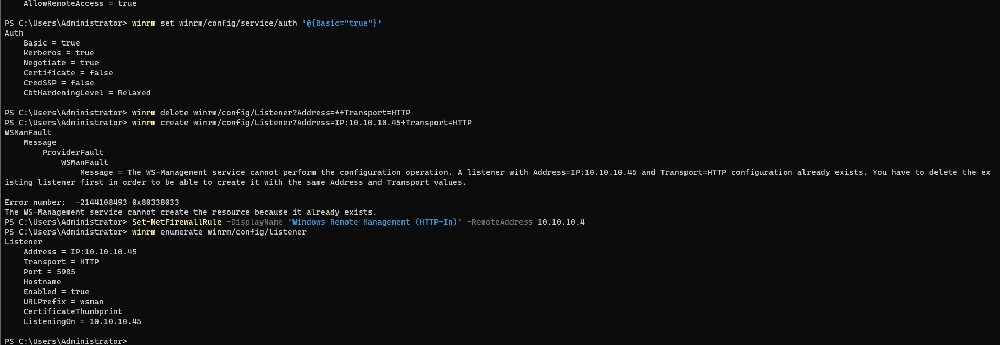
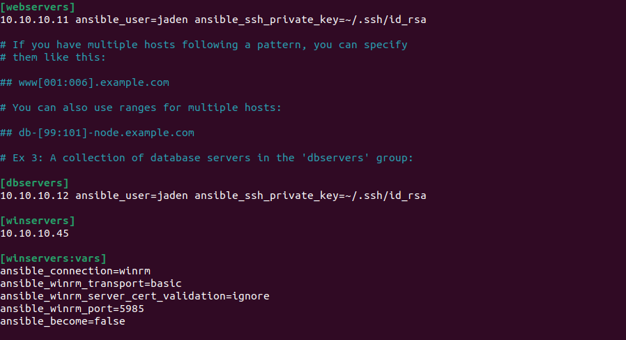
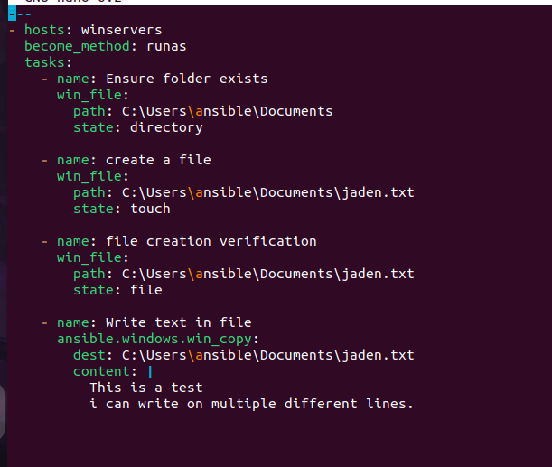
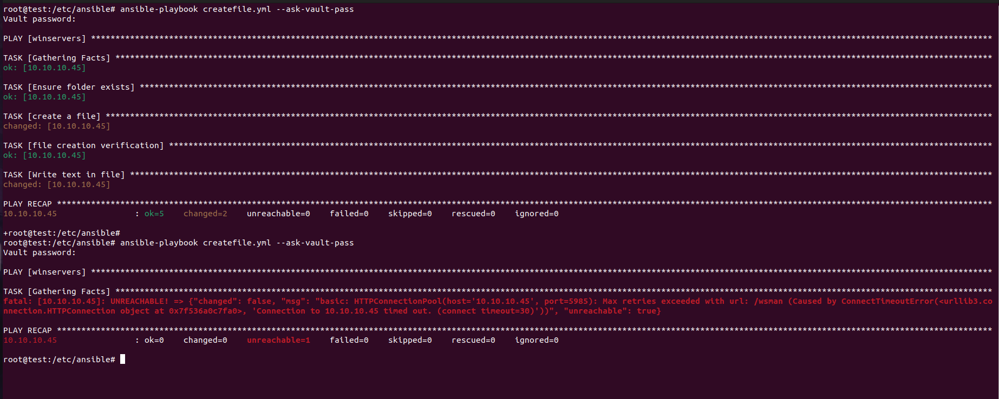
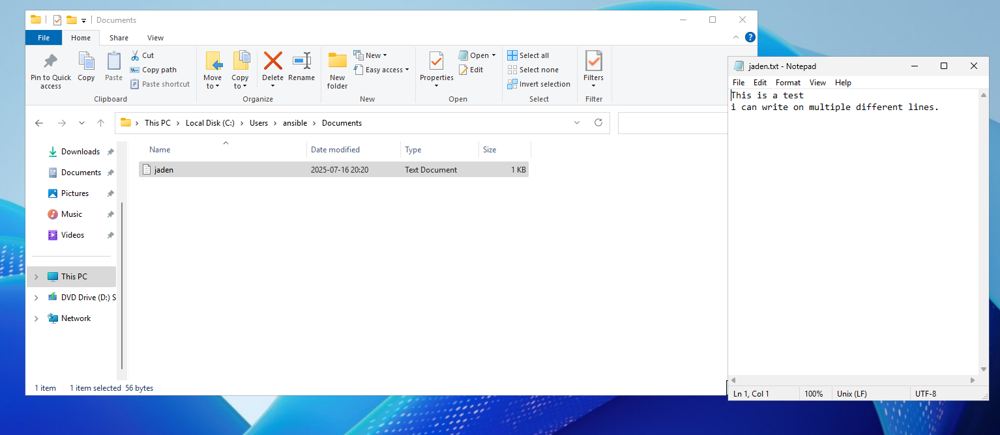
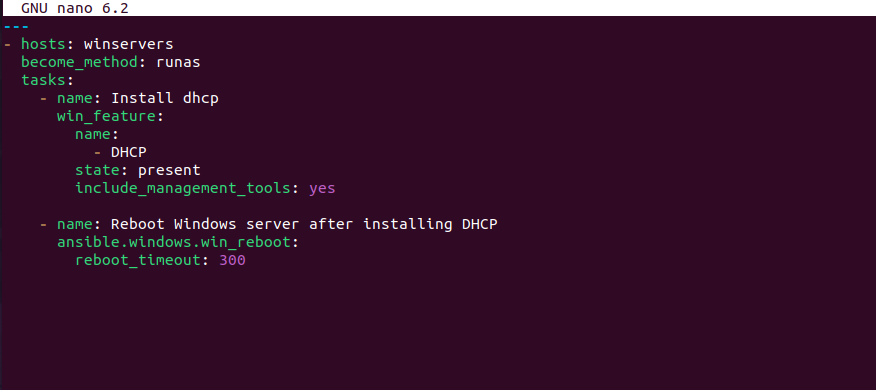
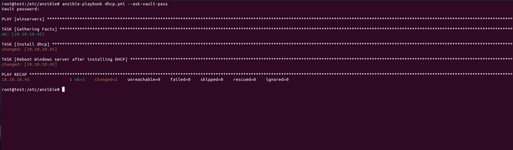
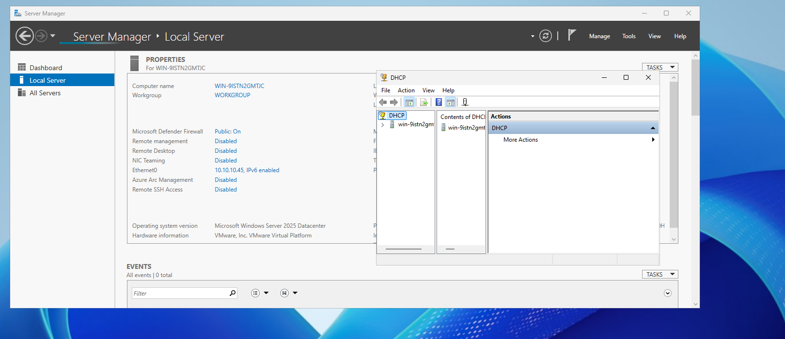
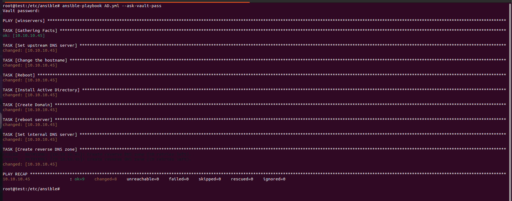
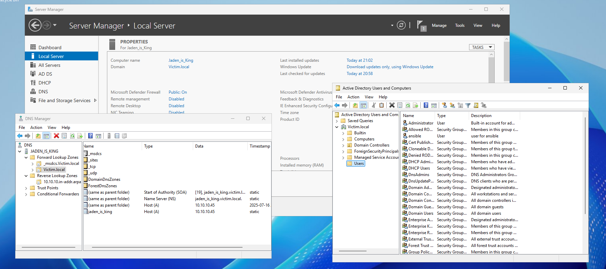

# Ansible Active Directory
one project  i had was to make a ansible script to install active directory with ansible. It was a 2 person project so i didn't get the chane to try it cause my job was to install Windows server with vagrant. In this project i will automate the installation of AD DNS and DHCP with ansible. This will be seperated in 7 or 8 different steps

## 1. setting up WinRM
for ansible to be able to connect to windows machine it needs the Windows machine to have Win RM. i will show you how i set up. Also I am using Windows server 2025 because i have a iso image and never used it yet. First go in Computer management user section

<br>
Create a new user. My user will be named ansible. Then add the user to the administrator group.

<br>

Now enter these following commands in powershell to configur WinRM
```bash
winrm quickconfig -q
winrm set winrm/config/service '@{AllowUnencrypted="true"}'
winrm set winrm/config/service/auth '@{Basic="true"}'
winrm delete winrm/config/Listener?Address=*+Transport=HTTP
winrm create winrm/config/Listener?Address=IP:10.10.10.4+Transport=HTTP
winrm enumerate winrm/config/listener
```
For a little bit of information i only want my server to be able to communicate with the ansible server which has the IP of 10.10.10.4 so i added a firewall rule to only allo winrm connection attemps from 10.10.10.4. also the listener address is 10.10.10.45 because that is the iIP of my windows server. The last command is to make sure all the previous commands worked. 



## 2. install plugins for ansible
for ansible to be able to work with Windows it need certains plugins. use these following commands in ubuntu.
```bash
sudo apt install python3-pip -y
pip3 install "pywinrm>=0.4.0"
```
## 3. upgrade Windows modules 
By default if you install ansible likle i showed you in another project it comes with the most used Windows modules. If not you can instrall them manually. Use these following commands.
```bash
ansible-galaxy collection install ansible.windows
ansible-galaxy collection install community.windows
```
Now for me when i was trying some script i was missing some Windows modules so to fix it enter this command now aswell.
```bash
ansible-galaxy collection install ansible.windows --upgrade
```
## 4 add Windows information to hosts and vault
first im going to create a directory named host_vars and create a file in it with the ip of my Windows server all in ansible vaullt just follow these steps.
```bash
ansible-vault create host_vars/10.10.10.45
```
when you in the file enter you username and password
```bash
ansible_user: ansible
ansible_password: passwordsomething
```
Because we created a directory host_vars in the same directory as our inventory (the file hosts) we will not need to call it during our playbook
Now in the hosts file found in /etc/ansible create a server group and add the following information
```bash
[windows]
10.10.10.45

[windows:vars]
ansible_connection=winrm
ansible_winrm_transport=basic
ansible_winrm_server_cert_validation=ignore
ansible_become=false
```

It should look something like this 



## 5 create file with ansible
In this part i will make a playbook to show you how to create a file in which ever directory you want. the playbook will be in the same directory as this README.md file. look at my playbook.



now i will run my playbook. Don't forget to ass --ask-vault-pass at the end of the command there is a way to not have to enter our vault password but i will not show that today


As you can see the script ran succefuly. I ran the script a second time to see if the windows firewall rule really worked. I changed the server IP from 10.10.10.4 to .3 and as expected i couldnt reach the Windows server. 



# 7. add dhcp

this was is easier than installing AD but i did recieve a problem while trying to install dhcp. i didnt know what was the exact name of the feature to pun in ansible when i put dhcp server it didnt work and when i checked online i had problems finding the correct rterm so i made anotherscript to find correct role name feautures and then i found that its just DHCP. i might add th3e script or not but for now lets concentrate on installing dhcp.

<br>
This is my file pretty simple




The script takes a couple minutes to run so dont worry if it taking a lot of times.

## installing AD
For this part i could of done it better. i made to extra vars file one for sensitive information and one for non sensitive information. It doesnt affect me now cause im just unsing one host but if i had multiple host in the group it might ruin it. to fix it all the information in the 2 files should go in the /host_vars/10.10.10.45. if i did this i could have multiple different host with different variable and still be able to run the script to all host at the same time. so you can try to add all information of both file to the single file and it should work.

anyway let me show you commands and what i did. for non sensitive informaiton i did this.
```bash
nano ad.vars.yml

dc_address: 10.10.10.45
dc_netmask_cidr: 24
dc_gateway: 10.10.10.2
dc_hostname: 'Jaden_is_King'
domain_name: "Victim.local"
local_admin: '.\administrator'
upstream_dns_1: 8.8.8.8
upstream_dns_2: 8.8.4.4
reverse_dns_zone: "10.10.10.0/24"
```

for the special file i did this.
```bash
ansible-vault create ad_passwords.yml

dc_password: .......
recovery_password: .......
```
These are my specific information i want the domain will be victim.local the server name will be Jaden_is_King. and etc
The script is too big so just look for the AD.yml file.





Next time i could try to even change the IP adress with ansible. so example i will have a blank server os with only WinRM configured and the user ansible as a image stored in my fog server so then i could run multiple server with similar configuration and try to change their IP to a unique one while installing AD DHC_P etc. This took me hours but it was a lot of fun. 


## help guides i used
i almost forgot to put the guides i used to do my projects.
```
https://madlabber.wordpress.com/2019/09/08/creating-a-new-active-directory-forest-with-ansible/
https://www.ansiblebyexamples.com/Getting%20Started/Windows%20Hosts/ 
```