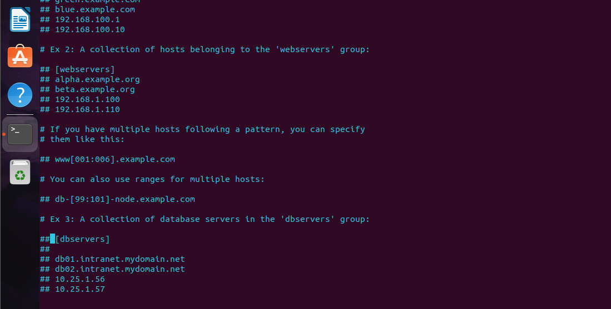
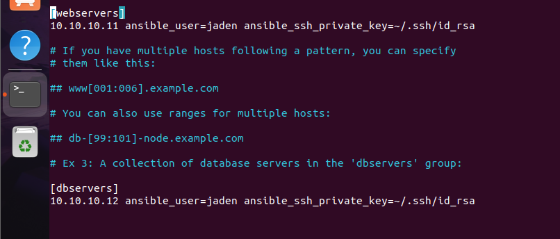
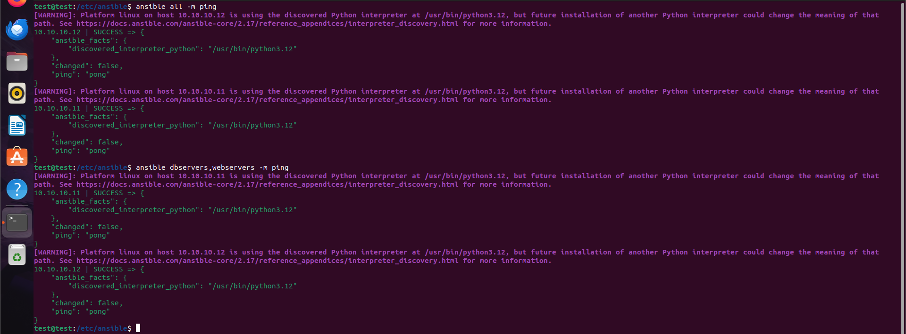
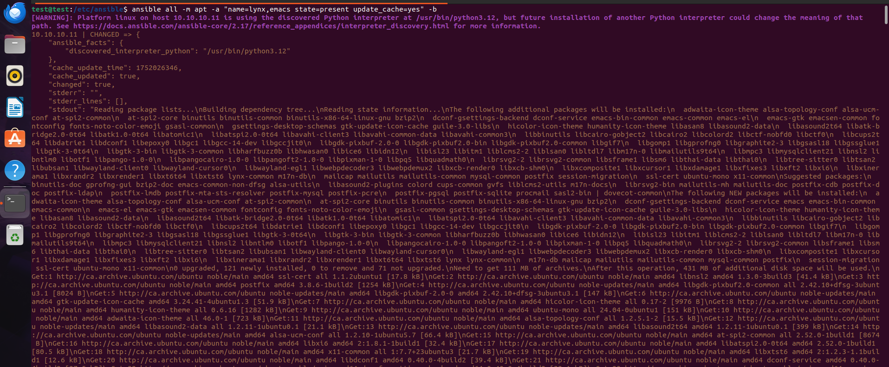
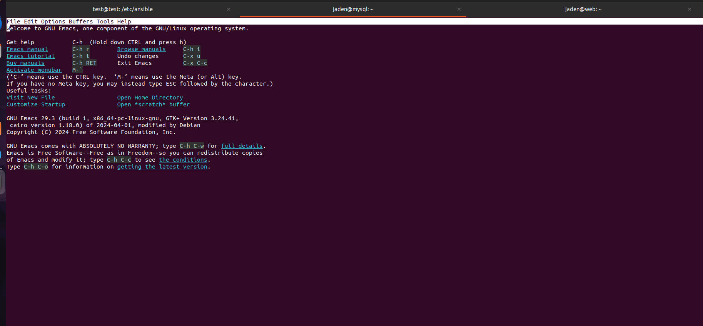
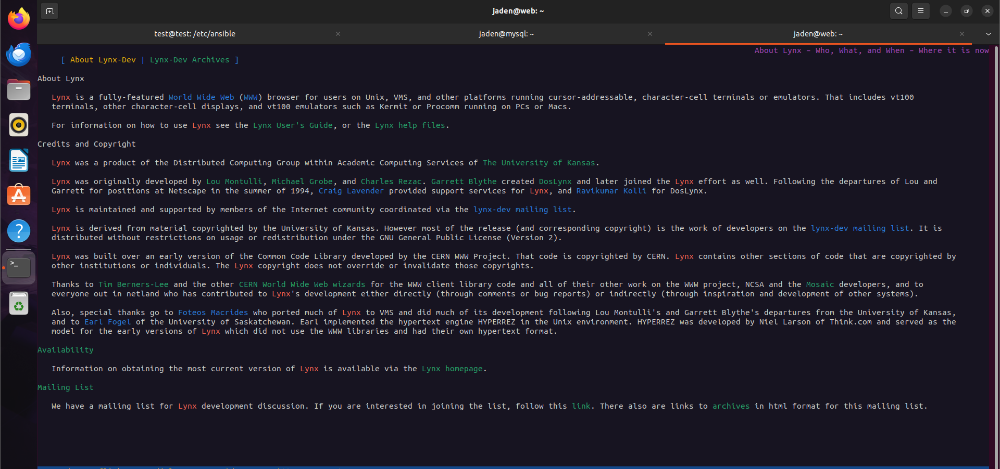
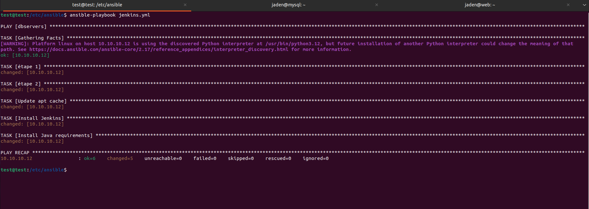
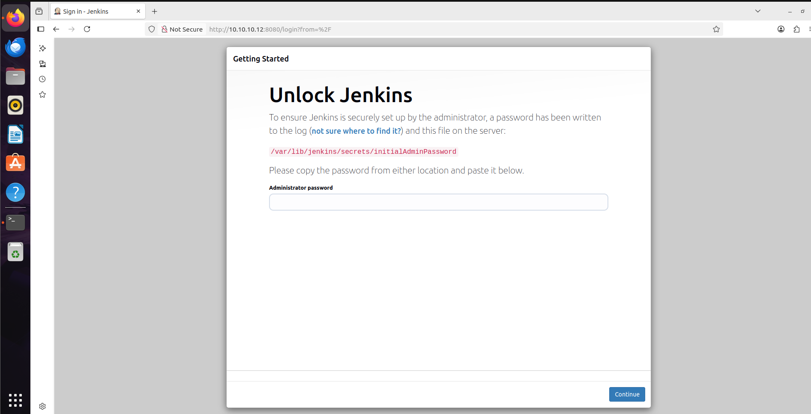
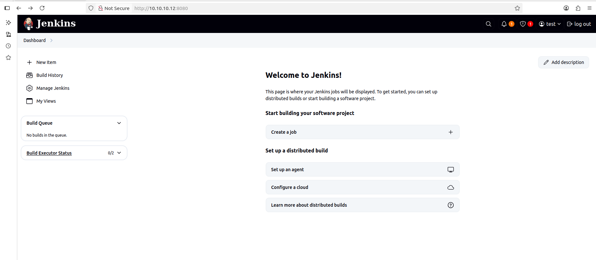

# automate installation of apps
this project was made to install apps on two different remot servers with ansible. I am using 2 ubuntu server named web and mysql with ip of 10.10.10.11 and 10.10.10.12.

## Installing Ansible
To install Ansible i will follow the instuction from there official site ```https://docs.ansible.com/ansible/latest/installation_guide/installation_distros.html#installing-ansible-on-ubuntu```<br><br>use the following commands to install ansible<br>
```bash
sudo apt update
sudo apt install software-properties-common
sudo add-apt-repository --yes --update ppa:ansible/ansible
sudo apt install ansible
cd /etc/ansible/
```
## RSA KEY
Before using ansible to make it easier I will create a rsa key and push it to both server so i wont have to use password authentification for ansible. Make sure the user you use has root access cause it might be needed for some commands. Use the following commands.
```bash
ssh-keygen -t rsa -f ~/.ssh/ansible-key
ssh-copy-id -i ~/.ssh/ansible-key.pub jaden@10.10.10.11
ssh-copy-id -i ~/.ssh/ansible-key.pub jaden@10.10.10.12
```

## Adding hosts to ansible
in "/etc/ansible/" you shoud see a couple of file but we are going to use the hosts file to add are server with the authentifications. You should see something like this at first<br><br>
<br>after adding you hosts with there username and your rsa key it should look like this <br>



## Ping test
in this part we will try ansible ping to see if it can reach the host. before let see if ansible took in count each host. Use the following command.
```bash
ansible-inventory --list -y
```

<br> Now we can try the ping there is to ways we can ping we can ping each host group individualy or ping every hosts. use either commands to test<br><br>
```bash
ansible all -m ping
ansible dbservers,webservers -m ping
```


## Installing simple application
Some application we can install with one simple command. The command is similar to the ping. We are going to install the lynx and emac app. This command wont work if user dont have sudo privileges with NOPASSWD:ALL in the /etc/sudoers file. Use the following command<br>
```bash
ansible all -m apt -a "name=lynx,emacs state=present update_cache=yes" -b
```


### emacs


### Lynx


## Apache
I will show you a simple ansible playblook that let you set up a basic apache web service on your machine. Just a little reminder to self ansible modules like apt and int the following case apache2_modules are like linux commands and the lines under each modules can be considered like arguments. Anyway this
```bash
---
- hosts: webservers,dbservers
  become: yes
  tasks:
    - name: install apache2
      apt:
        name: apache2
        update_cache: yes
        state: latest

    - name: enable mod_rewrite
      apache2_module:
        name: rewrite
        state: present
      notify:
        - restart apache2

  handlers:
    - name: restart apache2
      service:
        name: apache2
        state: restarted

```
the file must end with either .yml or .yaml. To run the ansible playbook you will have to enter the command: 
```bash
ansible-playbook name-of-playbook.yml
```

## Jenkins
Now lets try to install a more complex application Jenkins. When you search online you see to install jenkins you need a lot of prerequisite and have to enter a lot of different commands.  in this playbook i will use 2 other modules the get_url (which can be seen as wget) and shell. This is my jenkins ansible playbook.
```bash
- hosts: dbservers
  become: yes
  tasks:
    - name: étape 1
      get_url:
        url: https://pkg.jenkins.io/debian-stable/jenkins.io-2023.key
        dest: /usr/share/keyrings/jenkins-keyring.asc
        mode: '0644'

    - name: étape 2
      shell: |
        echo "deb [signed-by=/usr/share/keyrings/jenkins-keyring.asc] https://pkg.jenkins.io/debian-stable binary/" | tee /etc/apt/sources.list.d/jenkins.list > /dev/null

    - name: Update apt cache
      apt:
        update_cache: yes

    - name: Install Jenkins
      apt:
        name: jenkins
        state: present
        update_cache: yes

    - name: Install Java requirements
      apt:
        name:
          - fontconfig
          - openjdk-17-jre
          - openjdk-11-jdk
        state: present
        update_cache: yes
```
   
There might be some problem jenkins is usually on port 8080 so if it doesn't work make sur Jenkins is actually running with the following command
```bash
sudo systemctl status jenkins
```
if you see its running trying restarting that machibe and it should work. You should see the following


after you follow the step go in that file to see the password set up some plugings and and set up your admin account you should finaly be at the end with a functionning Jenkins <br>


